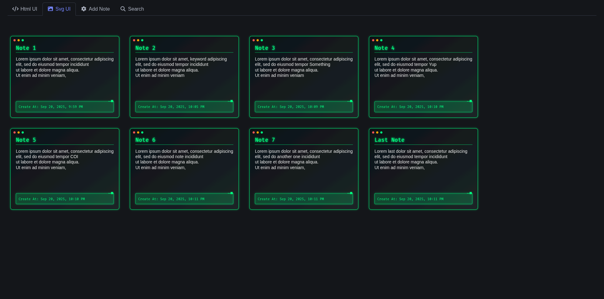

# 📝 SVG-Note




**SVG-Note** is an experimental note-taking web app where **SVG images** serve as the database. Each note is stored as an SVG element, making the database a visual representation of your notes. This project explores the intersection of **data storage** and **visualization** in a playful, unconventional way.

## ✨ Features
- Create, read, update, and delete notes stored within an SVG file.
- Notes are represented as SVG elements (text, shapes, or metadata).
- Experimental approach: the database doubles as a graph-like, colorful visualization.
- Built with **NestJS** for a clean, modular backend structure.

## 🚀 Tech Stack
- **Backend:** NestJS
- **Database:** SVG (XML file with embedded notes)
- **Frontend:** EJS template engine, Bluma CSS framework

## Prerequisites
- [Node.js](https://nodejs.org/) (v16 or higher)
- [NestJS CLI](https://docs.nestjs.com/cli/overview) (optional, for development)
- [EJS](https://ejs.co/) (for templating)
- [Bluma](https://bulma.io/) (for styling)

## Installation
1. Clone the repository:
   ```bash
   git clone https://github.com/l1l-01/svg-note
   cd svg-note
   ```

2. Install dependencies:
   ```bash
   npm install
   ```

3. Start the application:
   ```bash
   npm run start:dev
   ```

## Usage
- Navigate to `http://localhost:3000/notes` (or the configured port) in your browser.
- Create and manage notes, which are stored as SVG elements.
- View the SVG file to see the visual representation of your notes.

## Project Structure
- `src/`: NestJS application code
- `views/`: EJS templates
